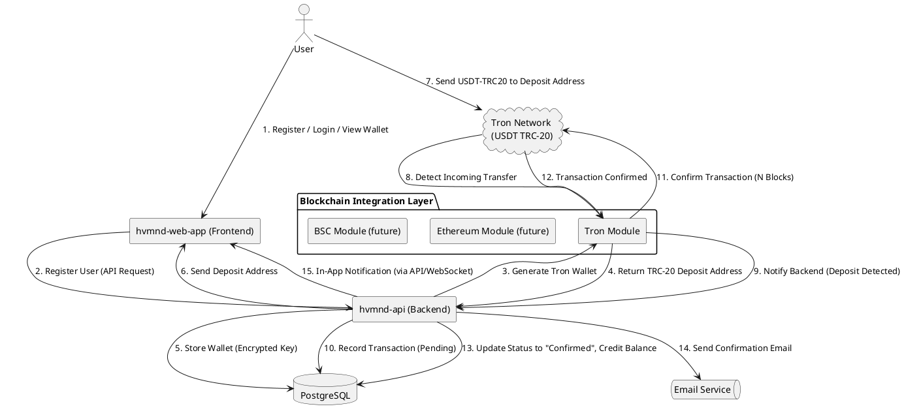

# High-Level Architecture Overview

**System Components:** The integration introduces a **Crypto Service** within the backend (`hvmnd-api`) to manage blockchain interactions. Each new user gets a unique TRC-20 USDT deposit address on the Tron network. The backend connects to a Tron **Full Node or third-party API** for blockchain data (e.g. transaction status), and uses PostgreSQL to record wallets and transactions. Deposit confirmations trigger notifications via email and in-app alerts. An abstraction layer isolates Tron-specific logic, allowing easy addition of other networks (ERC-20, BEP-20) later.

**Architecture Diagram (PlantUML):** Below is a high-level diagram illustrating the components and data flow:

*Figure: High-level architecture for TRC-20 integration in hvmnd-web-app.* The **Tron Module** handles TRC-20 specifics (key generation, monitoring Tron blockchain). Similar modules can be added for Ethereum (ERC-20) or BSC (BEP-20) to support future networks via the same abstraction layer. The Tron network may be accessed through a self-hosted Full Node or a reliable third-party provider (TronGrid/Tronscan APIs, QuickNode, NowNodes), abstracted behind the Tron Module. PostgreSQL persists all user accounts, wallet addresses, and transaction records. The Notification system (email + in-app) is triggered by the backend once a deposit is securely confirmed.

# Step-by-Step Implementation Guide

**1. Wallet Generation on User Registration:** When a new user signs up on `hvmnd-web-app`, the backend (`hvmnd-api`) will generate a **custodial Tron wallet** for that user. This involves creating a new Tron keypair (public address and private key). Generation is fast (milliseconds), so doing it at registration is reasonable. For example, using Tron cryptography libraries or APIs: in Golang, one can use a Tron SDK or secp256k1 key generation to produce a Tron address. The new address is then saved in PostgreSQL (e.g. in a `user_wallets` table or added to the users table) along with an **encrypted** version of the private key for security ([How to Build a Secure Crypto Wallet](https://www.openware.com/news/articles/how-to-build-a-secure-crypto-wallet#:~:text=Handling%20private%20keys%20is%20one,as%20a%20mnemonic%20seed%20phrase)). Mark the network as Tron TRC-20 for this wallet record. In summary:  

   - **Generate Tron address:** Use Tron API or library (no need to call an external node) to create a new address (e.g. `TronModule.GenerateAddress()` returns `publicAddress` and `privateKey`).  
   - **Store wallet in DB:** Save the `publicAddress` (for deposits) and securely store the `privateKey` (encrypted with a server-held key or HSM) ([How to Build a Secure Crypto Wallet](https://www.openware.com/news/articles/how-to-build-a-secure-crypto-wallet#:~:text=Handling%20private%20keys%20is%20one,as%20a%20mnemonic%20seed%20phrase)). Tie this record to the user’s ID.  
   - **Return address to user:** The frontend can display the user’s deposit address (e.g. “Your USDT (TRC-20) deposit address”). This is the address the user will send USDT to.

**2. Displaying Deposit Address:** The web-app should have a **“Deposit” section** in the user’s account showing the TRC-20 address. The address can be retrieved via an API call (e.g. `GET /api/v1/crypto/deposit-address`), or included in the registration response for convenience. Since each user has a unique address, no memo or tag is needed. The user is instructed to send USDT on the Tron network (TRC-20) to this address. (For testing mode, the UI should indicate that a Tron **testnet** address is used and provide instructions to obtain test USDT tokens.)  

**3. Handling a Deposit Transaction:** Once the user sends a USDT payment to their Tron address, the system needs to detect it and credit the user. There are two approaches to monitor the blockchain for incoming deposits:  

   - **Polling via Tron APIs:** The backend can periodically query the Tron node or a blockchain API for transactions involving the user’s address. For example, using Tron’s API to get TRC-20 transfer events for the address ([tronscan-frontend/document/api.md at master · tronscan/tronscan-frontend · GitHub](https://github.com/tronscan/tronscan-frontend/blob/master/document/api.md#:~:text=%2Fapi%2Fcontract%2Fevents%20Desc%3A%20List%20the%20TRC,X%20Get%20https%3A%2F%2Fapilist.tronscan.org%2Fapi%2Fcontract%2Fevents%3Faddress%3D%20TSbJFbH8sSayRFMavwohY2P6QfKwQEWcaz%26start%3D0%26limit%3D20%26start_timestamp%3D152985600000)). TronScan provides an API to list TRC-20 transfers by address, and Tron full node APIs (or TronGrid) allow querying transactions by account. A scheduled job (e.g. running every minute) can fetch recent transfers to each user address and identify new deposits.  
   - **Real-time event subscription:** For more immediate updates, use the Tron node’s event subscription (or a provider’s webhook). Tron full nodes can be configured with an event plugin (Kafka or database) to stream contract events. Alternatively, TronGrid/TronWeb offers a `.watch()` method to listen for contract events on specific addresses ([How to detect when my address received TRC20 USDT token : r/Tronix](https://www.reddit.com/r/Tronix/comments/j8hm1a/how_to_detect_when_my_address_received_trc20_usdt/#:~:text=Hi%2C%20when%20USDT%20is%20deposited,can%20figure%20it%20out%21)). The system can subscribe to the USDT contract’s **Transfer** event where the `to` field equals a user’s address. This yields an instant callback when a deposit arrives. Some third-party services (QuickNode, NowNodes) also support WebSocket or webhook notifications for address activity.  

   **4. Secure Deposit Confirmation:** When an incoming transfer is detected, **do not immediately credit** the user. Follow best practices to confirm the transaction’s finality:  

   - **Confirm the transaction on-chain:** Verify the transaction hash on the Tron blockchain (via the full node or API) and ensure it is a valid USDT TRC-20 transfer to the expected address. Check the amount and that the contract address matches official USDT (to avoid fake tokens).  
   - **Wait for N confirmations:** It’s prudent to wait for multiple block confirmations to guard against chain reorganization or fork issues. Even though Tron’s block time is ~3s and it’s rare to orphan blocks, many exchanges require a number of confirmations for safety. For example, one guideline suggests waiting for 10–19 confirmations for USDT on Tron ([Confirmation Requirements for Cryptocurrency Payments - EDIS Global Help & Docs](https://docs.edisglobal.com/faq/billing-lifecycle/cryptocurrency-payments-confirmation-guide-edis-global#:~:text=%2A%20Increased%20Confirmations%20%2810,payment%20recognition%20can%20take%20longer)) (Tron blocks are fast, so ~1 minute). You can configure this (e.g., wait for 6 blocks in test, maybe 12 in production for extra safety).  
   - **Mark as pending during confirmation:** While waiting, record the deposit in the database as a pending transaction. E.g., insert a row in a `transactions` or `payments` table with status “pending” and store the tx hash, amount, and user ID. This ensures you have a log even before final confirmation.

   The **Tron Module** in the backend can handle these details. For instance, after detecting an event, it calls `GetTransactionStatus(txHash)` on the Tron node until the required confirmations are met. Only then does it consider the deposit *confirmed*.

**5. Crediting the User Account:** After the deposit is securely confirmed, update the user’s balance in the system:  

   - **Update payments record:** If you used a “payment ticket” system (user pre-created a deposit request), find the matching ticket and mark it paid. Otherwise, simply create a new payment record indicating a successful deposit. For example, call the existing `CompletePayment` logic to mark the payment as “paid” ([hvmnd-api-description.txt](file://file-DmC1bSmLwoUTGXwQvwg3Rz#:~:text=162%20,var%20currentStatus%20string)) ([hvmnd-api-description.txt](file://file-DmC1bSmLwoUTGXwQvwg3Rz#:~:text=209%20,StatusInternalServerError)). The code can be extended to include the blockchain transaction ID and change the status from “unpaid” to “paid”.  
   - **Update user balance:** Increase the user’s balance field in the `users` table by the deposited amount (the `CompletePayment` handler already does this in the current code ([hvmnd-api-description.txt](file://file-DmC1bSmLwoUTGXwQvwg3Rz#:~:text=226%20,StatusInternalServerError)) ([hvmnd-api-description.txt](file://file-DmC1bSmLwoUTGXwQvwg3Rz#:~:text=241%20,))). This reflects the funds now available in the user’s account within `hvmnd`.  
   - **Record metadata:** Store details like the Tron transaction hash, number of confirmations, timestamp, and possibly the sender address (if needed for audit) in the database. This could mean adding columns to the `payments` table (e.g. `tx_hash`, `crypto_network`, `crypto_address`) or a separate `crypto_transactions` table linked to the payment. This historical data is useful for reconciliation and for the user’s transaction history.

**6. Sending Notifications:** Once the deposit is credited, the system should notify the user through multiple channels:  

   - **Email Notification:** Send an email to the user’s registered email stating that a deposit of X USDT (TRC-20) was received and credited. Use a templated email via an email service (SMTP or third-party like SendGrid). The backend can trigger this after updating the balance.  
   - **In-App Alert:** Create an in-app notification entry in the `notifications` table via the existing `CreateNotification` logic. For example, insert a notification like “Your deposit of X USDT has been confirmed” for that user, with `notification_platform = 'all'` (or `'web'` and another for `'email'` if you distinguish). Mark `is_sent` true for email if an email was sent. The frontend can pull unread notifications (e.g. via `GET /api/v1/notifications?user_id=...`) to display an alert or badge in the UI. If real-time updates are needed, consider using WebSockets or Server-Sent Events from the API to push the notification to the web-app instantly. Otherwise, the notification will appear the next time the user refreshes their notifications.  

**7. Abstraction for Multiple Networks:** Design the Crypto Service with an interface that generalizes actions like **generateAddress**, **getBalance**, **sendTransaction**, **monitorDeposits**. The Tron integration is one implementation of this interface. In the future, to add Ethereum (ERC-20) or BSC (BEP-20) support, you would create similar modules using an Ethereum node/Web3 provider or BSC provider. The rest of the application would call the same abstract methods, unaware of the underlying chain differences. For example, a factory can choose the appropriate module based on a currency type. This ensures the system is extensible. You might also use a **common database schema** for transactions that includes a `network` field, so deposits from different networks can be stored uniformly.  

**8. Testing Mode with Tron Testnet:** For development and QA, use Tron’s test network instead of mainnet. Tron offers testnets like **Nile** (as of recent) or Shasta. Configure the system to use a testnet full node or a testnet API (TronGrid has endpoints for Nile). The USDT token contract on Tron testnet is different from mainnet – for instance, on Nile testnet USDT’s contract address is `TXYZopYRdj2D9XRtbG411XZZ3kM5VkAeBf` ([TRON | NILE TESTNET](https://nileex.io/join/getJoinPage#:~:text=Get%201000%20USDT%20test%20tokens)). Obtain test USDT tokens from Tron’s faucet ([TRON | NILE TESTNET](https://nileex.io/join/getJoinPage#:~:text=USDT%20test%20tokens%20,obtained%20by%20entering%20account%20address)) to simulate deposits. The implementation should make it easy to switch networks (perhaps an `ENV` flag like `TRON_NETWORK = mainnet/testnet` and corresponding node URLs and token contract addresses). Ensure all components (wallet generation, transaction monitoring) respect this mode. Test the full flow on testnet: user registration, getting a testnet address, sending test USDT, and seeing the system detect and credit the deposit. Only after thorough testing should you connect to the mainnet for real deposits.

# Security Considerations and Best Practices

- **Secure Private Key Storage:** Since this is a custodial wallet system, the platform is responsible for safeguarding users’ private keys. **Never store private keys in plaintext.** Use strong encryption (e.g. AES-256) for any private key stored in the database ([How to Build a Secure Crypto Wallet](https://www.openware.com/news/articles/how-to-build-a-secure-crypto-wallet#:~:text=Handling%20private%20keys%20is%20one,as%20a%20mnemonic%20seed%20phrase)). The encryption key should be kept outside the code (for example, in an environment variable or a key management service). Consider using an HSM or dedicated key vault for high security. Also, restrict access to the keys – only the server process should be able to decrypt keys when needed (e.g. to sign a withdrawal). 

- **Least Privilege & Network Security:** If running a Tron full node, place it behind a firewall and do not expose its RPC interface to the public. The `hvmnd-api` server should be the only one interacting with it. Use TLS/HTTPS for any API calls to third-party blockchain providers to prevent interception. Ensure the PostgreSQL database is secured (passwords, no open public access) and that the `hvmnd-api` enforces authentication on all endpoints (which it already does via middleware). This prevents unauthorized queries or modifications (only the legitimate user or admin can check balances or trigger actions).

- **Deposit Confirmation & Anti-Fraud:** As mentioned, wait for multiple confirmations to avoid issues like double-spend or chain reorgs ([Confirmation Requirements for Cryptocurrency Payments - EDIS Global Help & Docs](https://docs.edisglobal.com/faq/billing-lifecycle/cryptocurrency-payments-confirmation-guide-edis-global#:~:text=%2A%20Increased%20Confirmations%20%2810,payment%20recognition%20can%20take%20longer)). This also helps defend against **false top-up attacks**, where an attacker might try to trick the system with an unconfirmed or invalid transaction. By only crediting after confirmation, the system ensures the deposit is irreversible. Additionally, only credit **exact token transfers** of USDT. If the user sends some other token or TRX by mistake, handle those separately (possibly notify the user, but do not count it as USDT). Using the official USDT TRC-20 contract address as a filter is crucial so that no other token transfer is mistaken for a deposit.

- **Withdrawal Security:** Even though the question focuses on deposits, if you later allow withdrawals, implement strict security: require authentication and possibly 2FA confirmation for large withdrawals, have withdrawal request limits, and monitor for suspicious activity. The private keys will be used to sign transactions sending USDT out, so ensure that process is secure (e.g. occur only on backend, never in frontend). Also, maintain some TRX in each user’s address or a central address for paying Tron network fees, since sending USDT will cost a small amount of TRX. Ideally, the system could hold users’ USDT in a secure central wallet and only move it from the deposit address to cold storage or to fulfill withdrawals, to minimize risk exposure on individual addresses.

- **Integrity and Monitoring:** Implement logging for all critical events (wallet creation, detected deposits, balance updates). In case of any discrepancy, you should be able to audit what happened via logs and the transaction IDs. Monitor the blockchain node’s health – if using a third-party API, handle downtime or slow responses gracefully (retry with backoff, etc.). It’s also good to have alerts if, say, a deposit is detected but doesn’t get confirmed in a long time, or if any suspicious transaction occurs. 

- **Updates and Patches:** Keep the Tron node software (if self-hosted) and any libraries (Tron SDK, web3 libraries) up to date to get the latest security fixes. Smart contract addresses (like USDT) generally won’t change on mainnet, but stay informed via official channels in case of token migrations or updates. When adding new networks, carefully review their specific security (e.g. Ethereum requires gas management, etc.).

# Scalability Strategies

- **Efficient Address Monitoring:** As the user base grows, polling each address one by one becomes inefficient. To scale, consider **batch querying** or event streaming. If using a Tron Full Node, you can stream blocks and scan for relevant transactions: each block’s TRC-20 Transfer events can be filtered for addresses in your database. This is much more scalable than N separate API calls. Using an indexed API (like TronScan’s) can also return multiple transactions in one query. Another strategy is to use **Bloom filters** or subscriptions: for example, QuickNode offers a token transfer webhook that can watch many addresses. Design the monitoring service to handle thousands of addresses, possibly by sharding (e.g. multiple worker processes each handling a subset of addresses or token events).

- **Horizontal Scaling of Services:** The `hvmnd-api` can be scaled out behind a load balancer for handling more users, but you must ensure the background job or service that monitors deposits doesn’t accidentally duplicate work across instances. It might be wise to have a single dedicated process (or a message queue system) for processing blockchain events to avoid race conditions (e.g. two servers crediting the same deposit). Tools like Redis locks or a job-queue can help coordinate tasks in a scaled environment.  

- **Database Scaling:** PostgreSQL should handle a growing number of transactions, but you can optimize by indexing fields like `user_id`, `tx_hash` in the payments/transactions table. This speeds up lookups when checking if a transaction was already processed. Partitioning the transaction table by date or network could help if volumes are huge. Also, regularly archive or summarize old records if the table grows extremely large over time.

- **Caching and Rate Limits:** To avoid hitting API rate limits of a third-party provider, implement caching layers. For example, if you poll the balance of an address and nothing changed, you might wait longer before the next check for that address. Use in-memory caching for recent transactions seen. If using your own node, ensure it has enough resources (RAM, CPU) as the demand grows; consider running a **Tron Solidity Node** in addition to Full Node for reliable confirmed data. For third-party APIs, you might need to upgrade plans or spread requests across multiple providers as you scale.

- **Multi-Chain Support:** The abstraction layer will help with scalability when adding new networks – each network’s integration can be scaled independently. For instance, you might run separate microservices for Ethereum and Tron, each optimized for that chain’s performance profile. Ensure the user experience remains unified: a user could have multiple deposit addresses (one per network), and the system can monitor all. From a scaling perspective, monitoring Ethereum (ERC-20) might have different challenges (higher latency, gas fees) than Tron – isolating them prevents one chain’s issues from affecting the other. Use consistent design patterns so that adding a new chain (say Solana or others in future) is as straightforward as plugging in a new module and deploying additional nodes or subscribing to an API.

- **Stateless vs Stateful Components:** Keep the web-app frontend and API stateless (so they can easily scale horizontally). The state (user balances, transactions) lives in PostgreSQL. The blockchain listeners can also be stateless if designed as idempotent workers that take tasks from a queue (e.g., tasks like “verify tx X for user Y”). This way, if a worker goes down, another can pick up without inconsistency. Such patterns will make the system more robust and scalable under heavy load.

# Sample API Endpoints

To integrate the crypto payment system, we can introduce a set of API endpoints. These endpoints facilitate retrieving deposit addresses, checking transaction status, and handling withdrawals in addition to the existing payment ticket logic. All endpoints should be under proper authentication (the existing JWT auth middleware).

- **`GET /api/v1/crypto/address`** – *Retrieve the user's deposit address.* Returns the TRC-20 USDT deposit address for the authenticated user (and potentially addresses for other networks in the future). Response example: `{ "network": "TRON-TRC20", "address": "TXYZ...abc" }`. (If the user’s wallet wasn’t created at registration for some reason, the backend can generate it on the fly here and then return it, though ordinarily it’s created upfront.)

- **`GET /api/v1/crypto/transactions`** – *List crypto transactions for the user.* Could accept query params like `type=deposit` or `withdrawal`, `network=TRON` etc. Returns records of past deposit confirmations or withdrawals, including status. For example, it might reuse the `payments` table data. This allows users to see pending or completed deposits. Example response data: `[ { "tx_hash": "...", "amount": 100, "status": "confirmed", "network": "TRON", "timestamp": "..."} ]`. The existing `GetPayments` handler could be extended or a new endpoint created for clarity.

- **`POST /api/v1/crypto/withdraw`** – *Initiate a withdrawal request.* Body: `{ "network": "TRON", "amount": 50, "to_address": "<TronAddress>" }`. This would allow a user to withdraw funds from their balance to an external address. The backend would verify the user’s balance >= amount, then use the stored private key to create and broadcast a USDT transfer transaction from the user’s custodial address to the requested address. (This is a custodial system, so effectively the platform is moving the tokens on user’s behalf.) The response could be a transaction ID or a status that the withdrawal is queued for processing. This endpoint should include additional security (e.g. email confirmation or 2FA, as noted) especially for larger amounts.

- **`POST /api/v1/payments/deposit-ticket`** (optional) – *Create a deposit payment ticket.* If maintaining the payment-ticket workflow, a user can call this with an `amount` to generate a record that they intend to deposit that amount. The response returns a `payment_ticket_id`. This isn’t strictly required with unique addresses (since any amount can be sent to the address), but can be used for user experience (e.g. user says “I plan to deposit 100 USDT” and the system can specifically watch for at least 100 USDT from that user). The deposit monitoring service can then match incoming amounts to open tickets (marking them paid via the `CompletePayment` route as currently implemented ([hvmnd-api-description.txt](file://file-DmC1bSmLwoUTGXwQvwg3Rz#:~:text=156%20,)) ([hvmnd-api-description.txt](file://file-DmC1bSmLwoUTGXwQvwg3Rz#:~:text=209%20,StatusInternalServerError))). If an amount doesn’t match exactly, staff could manually reconcile or automatically credit anyway. This endpoint ties into existing logic (`CreatePaymentTicket` in the code) ([hvmnd-api-description.txt](file://file-DmC1bSmLwoUTGXwQvwg3Rz#:~:text=97%20,Success%3A%20false)) ([hvmnd-api-description.txt](file://file-DmC1bSmLwoUTGXwQvwg3Rz#:~:text=138%20,StatusInternalServerError)), but you would extend it to associate the blockchain address or transaction once it arrives.

- **`GET /api/v1/notifications`** – *Retrieve notifications (including deposit alerts).* This exists already and can be used by the web-app to fetch the `"Your deposit of X USDT is confirmed"` message that was created. The web-app can then display it in a notification dropdown or page. Additionally, you might create a WebSocket endpoint (e.g. `/ws/notifications`) to push new notifications in real-time, though that’s an extension beyond REST endpoints.

These sample endpoints demonstrate how a user or the frontend would interact with the crypto system (fetching their wallet, seeing transactions, requesting withdrawals). They complement the internal processes that actually integrate with the Tron blockchain.

# Required Configurations and Dependencies

To ensure a smooth integration, several configurations and dependencies must be set up:

- **Tron Node / API Provider:** You need access to the Tron blockchain. For a full node, deploy the official Tron Full Node (Java-based). Set `TRON_NODE_URL` in the backend config (if using HTTP API) or the gRPC endpoint. If using a third-party like QuickNode or NowNodes, obtain an API key and set the provider’s URL. For example, `TRON_API_URL=https://<network>.api.nownodes.io/?API_KEY=xyz`. Ensure this URL is switched to Tron testnet for development (e.g. Nile testnet endpoints) and Tron mainnet for production. The code will use this to query transactions and broadcast transfers. 

- **USDT Contract Details:** Configure the USDT TRC-20 contract addresses for each network. For instance, in `.env` file: `TRON_USDT_CONTRACT=TR7NHqjeKQxGTCi8q8ZY4pL8otSzgjLj6t` for mainnet (that’s the known TRC20 USDT contract on Tron ([How to detect when my address received TRC20 USDT token : r/Tronix](https://www.reddit.com/r/Tronix/comments/j8hm1a/how_to_detect_when_my_address_received_trc20_usdt/#:~:text=documentation%2C%20just%20one%20more%20question%2C,transfer%20USDT%2C%20is%20this%20correct))), and `TRON_USDT_CONTRACT_TEST=TXYZopYRdj2D9XRtbG411XZZ3kM5VkAeBf` for testnet ([TRON | NILE TESTNET](https://nileex.io/join/getJoinPage#:~:text=Get%201000%20USDT%20test%20tokens)). This ensures the system only listens for the correct token contract events.

- **Environment Flags:** Add a setting to distinguish `ENV=development` vs `production` (or a dedicated flag like `USE_TRON_TESTNET=true/false`). In test mode, the system should connect to testnet nodes and perhaps use test API keys. Also, you might set `MIN_CONFIRMATIONS=...` as a configurable number of block confirmations required.

- **Email Service Credentials:** Set up SMTP or email service credentials in the environment (e.g. SMTP host, user, pass or API keys for services like SendGrid/Mailgun). The notifications module will use this to actually send emails. Ensure email templates are in place for deposit notifications.

- **PostgreSQL Migrations:** Update the database schema to support the crypto integration. This may include: adding `crypto_address` and `crypto_network` fields to the `users` or `payments` table, a new `crypto_transactions` table with fields (id, user_id, tx_hash, network, token, amount, confirmations, status, timestamp), and possibly a `wallets` table if storing multiple addresses per user (one per network). Use migrations to apply these changes. The `models` in code should be updated to map these new fields. For example, a `Wallet` model for a custodial wallet, and extending the `Payment` model to include crypto info.

- **Dependencies/Libraries:** Install any required libraries for Tron and cryptography. For example, if using Golang, you might use the **go-tron** SDK or a TronWeb JavaScript (if a separate service in Node.js is used). Ensure that the Dockerfile includes these or that the service can access them. Also, include a library for sending emails (if not already, e.g. something like Gomail or an SMTP client in Go). The integration may also benefit from a task scheduler or job queue library to manage the polling/confirmation tasks.

- **Testing and DevOps:** In a development environment, you’ll need Tron testnet funds (TRX for gas and USDT for token). Configure the test to use faucet for TRX and USDT periodically. In production, ensure you maintain a TRX balance in each wallet or a central gas wallet to pay network fees for sending USDT. From a DevOps perspective, monitor the Tron node’s resource usage. If using a provider, be mindful of request limits – you might configure a caching layer or rate limiter in the code to avoid hitting those limits.

By configuring these aspects, the integration will operate smoothly. Document all these configurations for future maintainers. For instance, an entry in README might say: “Set `TRON_NODE_URL` to your full node RPC endpoint. If you don’t run a node, use NowNodes/QuickNode and set the URL and API key. Set `TRON_NETWORK=mainnet` or `testnet` accordingly. Ensure `POSTGRES_URL` is configured for the database where wallet and transaction info will be stored.” 

With the above architecture and steps, `hvmnd-web-app` will be equipped with a robust USDT (TRC-20) payment integration. This design emphasizes security (unique addresses, confirmations, encrypted keys), provides a responsive user experience (notifications on deposit), and is built to scale and adapt (multi-chain support via abstraction, scalable monitoring). Following this guide, the team can implement the solution in a way that is **practical** (using existing tools and services), **secure** (safeguarding assets and data), and **scalable** (ready for growth and additional blockchains) to ensure seamless adoption in the application. 

 ([How to detect when my address received TRC20 USDT token : r/Tronix](https://www.reddit.com/r/Tronix/comments/j8hm1a/how_to_detect_when_my_address_received_trc20_usdt/#:~:text=Hi%2C%20when%20USDT%20is%20deposited,can%20figure%20it%20out%21)) ([tronscan-frontend/document/api.md at master · tronscan/tronscan-frontend · GitHub](https://github.com/tronscan/tronscan-frontend/blob/master/document/api.md#:~:text=%2Fapi%2Fcontract%2Fevents%20Desc%3A%20List%20the%20TRC,X%20Get%20https%3A%2F%2Fapilist.tronscan.org%2Fapi%2Fcontract%2Fevents%3Faddress%3D%20TSbJFbH8sSayRFMavwohY2P6QfKwQEWcaz%26start%3D0%26limit%3D20%26start_timestamp%3D152985600000)) ([Confirmation Requirements for Cryptocurrency Payments - EDIS Global Help & Docs](https://docs.edisglobal.com/faq/billing-lifecycle/cryptocurrency-payments-confirmation-guide-edis-global#:~:text=%2A%20Increased%20Confirmations%20%2810,payment%20recognition%20can%20take%20longer)) ([TRON | NILE TESTNET](https://nileex.io/join/getJoinPage#:~:text=Get%201000%20USDT%20test%20tokens))